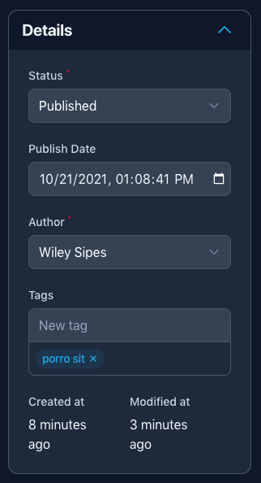
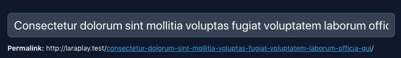
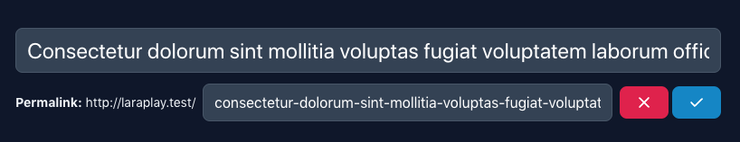
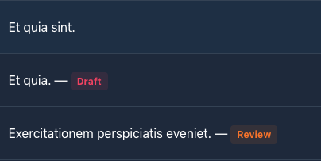

# Trov Components

A set of components, fields and layouts to extend Filament Admin with components used in [Trov CMS](https://github.com/awcodes/trov).

## Filament Admin

### **Panel**



All setting on the panel are optional.

```php
Panel::make('Details')
    ->collapsible()
    ->isCollapsed()
    ->heading('Overwrites make string')
    ->desciption('Description goes here.')
```

### **Fixed Sidebar Layout**

Just return it directly from your form function in your model resource.

```php
public static function form(Form $form): Form
{
    return FixedSidebar::make()
        ->schema([
            // Main section form components
        ], [
            // Sidebar form components
        ]);
}
```

### Multi Action Button

Usage:

Publish necessary views

```bash
php artisan trov-components:make-multi-action-button
```

Add the following to either Your EditPage or CreatePage resources, or both. And the view will take care of the rest.

```php
protected bool $hasMultiActionButton = true;
```

## Forms

### **Date Input**


```php
DateInput::make(string $fieldname)
    ->label('Publish Date')
    ->withoutTime() //optional
```

### **Password Generator**


All methods from TextInput are available.

```php
PasswordGenerator::make(string $fieldname)
    ->passwordLength(int $length = 12)
    ->hasNumbers(bool $hasNumbers = true)
    ->hasSymbols(bool $hasSymbols = true)
```

### **Title With Slug**

 

Creates a TextInput with the ability to modify the slug after creation, but preserves the slug when editing to help with SEO.

```php
TitleWithSlug::make(
    string $titleFieldName = 'title',
    string $slugFieldName = 'slug',
    string|Closure $basePathForResource = '/'
)->columnSpan('full')
```

### **Separator**

Just outputs a sensible hr to help separate components.

```php
Separator::make()
```

### **Timestamps**

Outputs Created At and Updated At information blocks.

```php
Timestamps::make()
```

## Tables

### **Title With Status Indicator**



```php
TitleWithStatus::make(string $fieldname = 'title')
    ->statusField(string $fieldname = 'status') // optional
    ->statuses(array | Arrayable (Enum) Status::class)
    ->colors(array | Arrayable (Enum) Status::colors())
    ->hiddenOn(string | null Status::Published->name) //optional
```

### **Soft Delete Filter**

Require that your model and resources are setup for Soft Deletes. This might become obsolete if Filament impliments their own way of handling Soft Deletes.

```php
SoftDeleteFilter::make()
```
